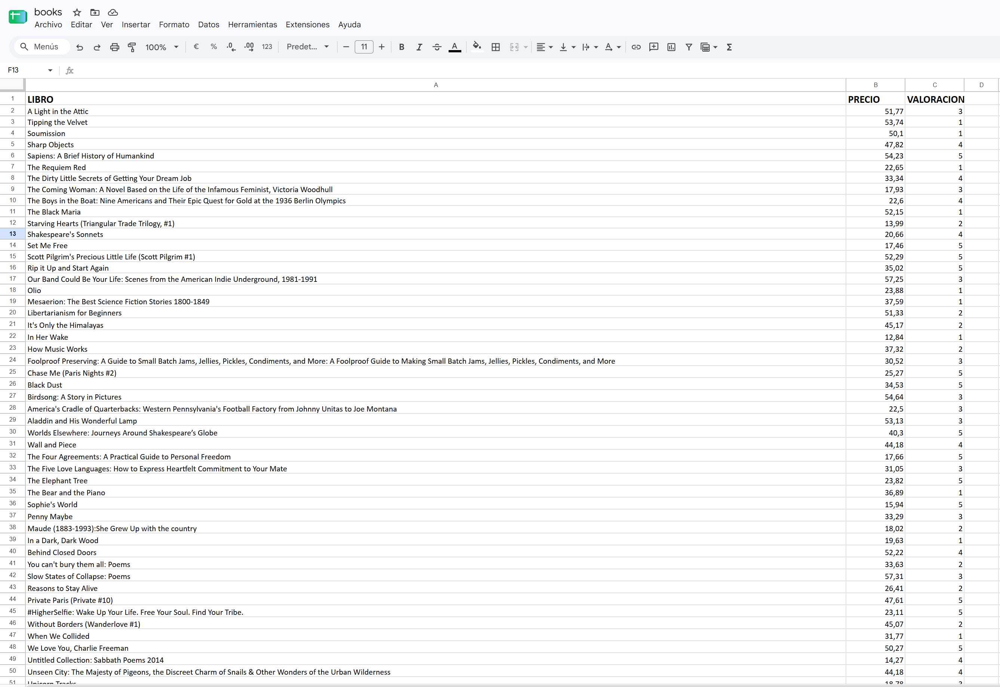

# 📊 E-Commerce Market Intelligence & Price Scraper

An advanced, asynchronous web scraping architecture designed to audit corporate product catalogs across multi-paginated structures. Built with **Python**, **Playwright**, and **BeautifulSoup**, it extracts complex variables and compiles structured data formats.

## 🚀 Key Architectural Features

- **Asynchronous Headless Navigation:** Powered by Playwright to simulate authentic browser sessions, bypassing standard endpoint restrictions and ensuring rapid data collection across 50 independent pages.
- **Robust DOM Parsing:** Utilizes BeautifulSoup to efficiently scrape HTML nodes, target distinct element classes (`.product_pod`, `.price_color`, `.star-rating`), and capture full data points without truncation.
- **Dynamic Variable Transformation:** Translates alphanumeric star ratings into structured numeric values (integers `1-5`) and cleans currency raw strings into floating-point numbers ready for business analytics.
- **Automated Enterprise Excel Reporting:** Uses Pandas DataFrames coupled with OpenPyXL styling to deliver production-ready spreadsheets featuring:
  - Automated column width adjustment dynamically calculated based on string density length.
  - High-visibility header scaling (14pt Bold Calibri font) for instant corporate scanning.
  - Fail-safe pagination logic to handle conditional loops natively.

## 🛠️ Corporate Tech Stack

- **Async Browser Automation:** Playwright (Chromium Engine)
- **HTML Document Parsing:** BeautifulSoup4
- **Data Structuring & Compilation:** Pandas
- **Spreadsheet Design Mastering:** OpenPyXL

---
*Developed natively utilizing strict asynchronous loops, optimized data mapping, and Object-Oriented patterns.*
